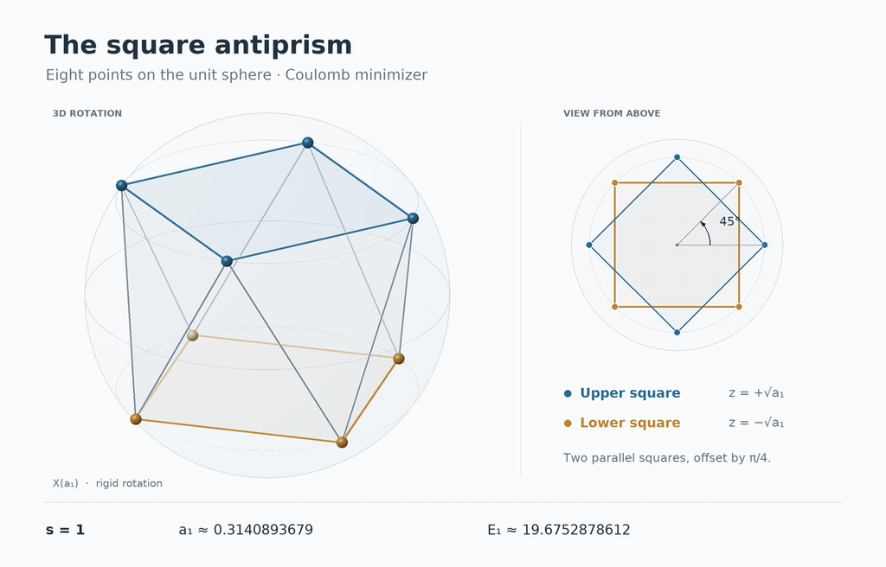

# Energy minimization for eight points on the sphere

This repository contains a Lean 4 formalization as well as numerical certificates of results from the paper
**Energy minimization for eight points on the sphere** by **Liudmyla Kryvonos**,
**Lukas Liehr** and **Mitchell A. Taylor**.



The animation shows $X(a_1)$ with $a_1\approx0.314089367889$. The two
squares lie at heights $\pm\sqrt{a_1}$; the view from above shows their
relative rotation by $\pi/4$. The configuration is fixed while the viewing
direction changes. Its Coulomb energy is approximately $19.675287861233$.

## Lean-verified statements

In order to state the formalized result we define for eight distinct points $Y=(y_1,\ldots,y_8)$ on the unit sphere
$S^2\subset\mathbb{R}^3$ the quantities
```math
\begin{aligned}
E_s(Y)&=\sum_{1\le i\lt j\le8}\lVert y_i-y_j\rVert^{-s},\qquad s>0,\\
E_0(Y)&=-\sum_{1\le i\lt j\le8}\log\lVert y_i-y_j\rVert.
\end{aligned}
```
For $0\lt a\lt1$, let $X(a)$ be the square antiprism formed by two squares
at heights $\pm\sqrt a$, each of radius $\sqrt{1-a}$, with relative
rotation $\pi/4$. Congruence means equality up to an orthogonal
transformation and a permutation of the points. We provide a Lean verification of the following statement.

**Theorem.** The following four statements hold.

**(i) Logarithmic energy.** Let $a_0=(2\sqrt{58}-13)/7$. For every
configuration $Y$ of eight distinct points on $S^2$,
$E_0(Y)\ge E_0(X(a_0))$, with equality if and only if $Y$ is congruent
to $X(a_0)$. Moreover,

```math
E_0(X(a_0))=-12\log 2-6\log(1-a_0)-4\log(1+6a_0+a_0^2).
```

**(ii) Coulomb energy.** There is a unique stationary parameter $a_1\in(0,1)$
for the function $a\mapsto E_1(X(a))$. For every configuration $Y$
of eight distinct points on $S^2$, $E_1(Y)\ge E_1(X(a_1))$, with
equality if and only if $Y$ is congruent to $X(a_1)$. Its energy is

```math
\begin{aligned}
E_1(X(a_1))={}&\frac{4\sqrt{2}+2}{\sqrt{1-a_1}}
+\frac{8}{\sqrt{2-\sqrt{2}+(2+\sqrt{2})a_1}}\\
&+\frac{8}{\sqrt{2+\sqrt{2}+(2-\sqrt{2})a_1}}.
\end{aligned}
```

**(iii) Large Riesz exponents.** For each $s\ge0$, the function
$a\mapsto E_s(X(a))$ has a unique stationary parameter $a_s\in(0,1)$,
with $a_0=(2\sqrt{58}-13)/7$. There exists $S\gt0$ such that, for every
$s\ge S$ and every configuration $Y$ of eight distinct points on $S^2$,
$E_s(Y)\ge E_s(X(a_s))$, with equality if and only if $Y$ is congruent
to $X(a_s)$.

**(iv) Completely monotone potentials.** There exist a smooth function
$f:(0,\infty)\to\mathbb{R}$ and a configuration $Y$ of eight distinct
points on $S^2$ such that
$(-1)^k f^{(k)}(t)\gt0$ for every integer $k\ge0$ and every $t\gt0$,
$\lim_{t\downarrow0}f(t)=\infty$, and

```math
\sum_{1\le i\lt j\le8}f\bigl(\lVert y_i-y_j\rVert^2\bigr)
\lt\sum_{1\le i\lt j\le8}f\bigl(\lVert x_i(a)-x_j(a)\rVert^2\bigr)
\qquad\text{for every }a\in(0,1),
```

where $x_1(a),\ldots,x_8(a)$ are the vertices of $X(a)$.
Thus no square antiprism minimizes the energy associated with $f$.

## Computer-assisted proof for all nonnegative exponents

The directory [Certificates_All_s](Certificates_All_s) contains a computer-assisted
proof that $X(a_s)$ is the unique global minimizer, up to congruence,
for every real $s\gt0$ and for logarithmic energy at $s=0$. The proof uses
exact interval certificates on 111 closed intervals covering $[0,124]$,
together with an analytic argument and exact computational checks for
$s\ge124$. The certificate data and
[verification records](Certificates_All_s/verification)
are included. This full-range result has not yet been verified in Lean.
Instructions for reproducing the computations are in
[CAP.md](Certificates_All_s/CAP.md).

## Lean entry points

- [Showcase.lean](Showcase.lean): the definitions and four theorem statements,
  with `sorry` in place of the proofs.
- [Showcase_WithProofs.lean](Showcase_WithProofs.lean): the same definitions
  and statements with complete proofs.
- [LeanCode.lean](LeanCode.lean): the complete proof library.
- [LeanCode/MainTheorem.lean](LeanCode/MainTheorem.lean): the three global
  optimality results.
- [LeanCode/Monotonic/Proof.lean](LeanCode/Monotonic/Proof.lean): the
  counterexample for completely monotone potentials.
- [comparator.json](comparator.json): Comparator configuration for the
  four theorems and their definitions in the two showcase files.

The four proved theorems depend only on `propext`, `Classical.choice`
and `Quot.sound`.

## Repository layout

| Path | Contents |
| --- | --- |
| [LeanCode/Logarithmic](LeanCode/Logarithmic) | Logarithmic minimum and uniqueness. |
| [LeanCode/Coulomb](LeanCode/Coulomb) | Coulomb minimum and uniqueness. |
| [LeanCode/LargeS](LeanCode/LargeS) | Global optimality for sufficiently large Riesz exponents. |
| [LeanCode/Monotonic](LeanCode/Monotonic) | Counterexample for completely monotone potentials. |
| [LeanCode/Bridge.lean](LeanCode/Bridge.lean) | Coordinate and stationarity identities connecting the developments. |
| [Certificates](Certificates) | Logarithmic and Coulomb certificates with independent Python checkers. |
| [Certificates_All_s](Certificates_All_s) | Certificates and checkers for the full exponent range. |
| [Visualization](Visualization) | Animation, video and still image. |

## Building

The project uses Lean 4.33.0. The dependencies are pinned in
[lake-manifest.json](lake-manifest.json). To compile the library and both
showcase files, run

```sh
lake exe cache get
lake build
```

`Showcase.lean` produces four expected `sorry` warnings.
